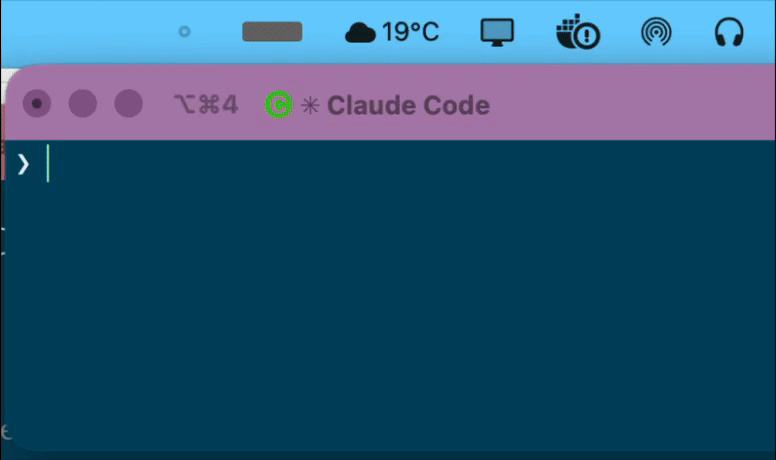

# claude-lamp

[](LICENSE)


A menu-bar status light for [Claude Code](https://claude.com/claude-code) on macOS. Glance up to see whether Claude needs you, without watching the terminal.

<p align="center">
  
</p>

A small bar pulses on activity, styled like an old incandescent indicator behind a diffuser: quick flash, brief hold, exponential cool-down.

## What it shows

| Bar | Meaning |
|-----|---------|
| **Red** | Claude is blocked on a permission prompt. Pulses until you act. |
| **Green** | Turn finished, your move. Fades on its own after a couple of minutes. |
| **Dim grey** | Idle, nothing pending. |

Claude Code also emits a "waiting for your input" nudge ~60s after every turn; that one is deliberately ignored, so a finished session shows green and fades instead of nagging you in red forever.

Running several sessions at once? The bar shows the most urgent state across all of them: red if *any* session is blocked on a permission, otherwise green if any just finished.

## Requirements

macOS, plus Xcode Command Line Tools for `swiftc`: `xcode-select --install`.

## Install

```bash
git clone https://github.com/tkanov/claude-lamp.git
cd claude-lamp
./install.sh
```

Restart Claude Code afterward so the hooks load. Nothing prebuilt is downloaded: the app compiles locally, so there is no Gatekeeper prompt and nothing to notarize.

## What the installer touches

1. Installs the app into `~/.claude/lamp/`.
2. Adds a LaunchAgent at `~/Library/LaunchAgents/claude-lamp.plist` (starts at login, relaunches on crash, stays quit when you quit it).
3. Merges three hooks (`Notification`, `Stop`, `UserPromptSubmit`) into `~/.claude/settings.json`. Existing hooks are preserved, the file is backed up to `settings.json.bak`, and re-running never duplicates.

## Using it

- **Left-click** the bar to jump to the longest-waiting session's terminal and clear that signal.
- **Right-click** to Quit.

Red persists until you act on it: submit a prompt in that session (its `off` hook) or click the lamp. Green clears on your next prompt, on the timeout, or, running a single session, when you focus its terminal after a brief grace. With multiple sessions active that focus-clear stands down, because focusing one window can't say which session you meant.

## Tuning

Every knob is a constant at the top of `lamp.swift` (colors, pulse speed, hold fraction, cool-down, dim floor, green timeout, bar size). Edit your installed copy and rebuild:

```bash
swiftc -O ~/.claude/lamp/lamp.swift -o ~/.claude/lamp/claude-lamp
launchctl kickstart -k gui/$(id -u)/claude-lamp
```

## How it works

A Claude Code hook is a short-lived command and can't hold an animated icon, so there are two pieces: a persistent menu-bar app that runs the animation, and hooks that write a state word plus the terminal's bundle id to `~/.claude/lamp/sessions/<session-id>`, one file per session. The app polls that directory and shows the most urgent state across sessions (red outranks green), pruning each as it clears or times out.

## Uninstall

```bash
./uninstall.sh
```

Restart Claude Code afterward to drop the hooks from the running session.

## Caveats

- The dot is a single color: with parallel sessions it shows the most urgent (red over green), not a count.
- Click raises the session's terminal *app*, not a specific window, so across several windows of one app it can't jump to the exact one; per-session clearing there comes from each session's own hooks.
- A session that exits without firing its `off` hook can leave a stale red; left-clicking the bar clears the shown signal.
- macOS only (AppKit menu bar).

## License

MIT. See [LICENSE](LICENSE).
